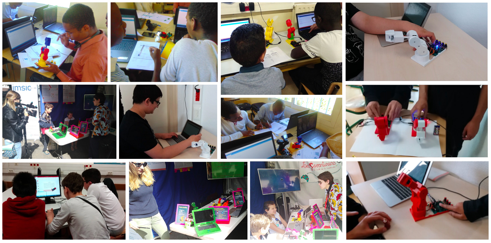

[![Contributors][contributors-shield]][contributors-url]
[![Forks][forks-shield]][forks-url]
[![Stargazers][stars-shield]][stars-url]
[![Apache-2.0 License][license-shield]][license-url]
[![LinkedIn][linkedin-shield]][linkedin-url]

[linkedin-shield]: https://img.shields.io/badge/-LinkedIn-black.svg?style=for-the-badge&logo=linkedin&colorB=blue
[linkedin-url]: https://linkedin.com/in/almoutazar-saandi

[contributors-shield]: https://img.shields.io/github/contributors/almtzr/Pedro.svg?style=for-the-badge&colorB=red
[contributors-url]: https://github.com/almtzr/Pedro/graphs/contributors

[forks-shield]: https://img.shields.io/github/forks/almtzr/Pedro.svg?style=for-the-badge&colorB=yellow
[forks-url]: https://github.com/almtzr/Pedro/network/members

[stars-shield]: https://img.shields.io/github/stars/almtzr/Pedro.svg?style=for-the-badge&colorB=orange
[stars-url]: https://github.com/almtzr/Pedro/stargazers

[license-shield]: https://img.shields.io/github/license/almtzr/Pedro.svg?style=for-the-badge&colorB=286
[license-url]: https://github.com/almtzr/Pedro/blob/main/LICENSE

<br>

# Pedro - The 3D Printed Mini Robot (work in progress...)

## Overview

Pedro is a mini robot designed to be entirely 3D printed and assembled without any tools. Equipped with four mini servo motors and powered by a custom-made Arduino-compatible board, Pedro can be controlled remotely using an nRF24L01 module. This versatile and educational robot is perfect for hobbyists, students, and makers looking to explore robotics, electronics, and programming.

## Table of Contents
1. [Project Description](#project-description)
2. [Features](#features)
3. [Required Materials](#required-materials)
4. [Assembly Instructions](#assembly-instructions)
5. [Programming Pedro](#programming-pedro)
6. [Remote Control Setup](#remote-control-setup)
7. [Powering Pedro](#powering-pedro)
8. [Contributing](#contributing)
9. [License](#license)
10. [Contact](#contact)

## Project Description

Pedro is a compact, DIY robot that you can build and program yourself. All parts of Pedro are designed to be 3D printed, and the robot can be assembled without any additional tools. The custom Arduino-compatible board, along with the nRF24L01 module, allows for wireless control, making Pedro a flexible and interactive project.

< **image** >

### Key Components:
- **4 Mini Servo Motors**: For precise movements.
- **Custom Arduino-Compatible Board**: Designed specifically for this project, offering easy integration with the robot's components.
- **nRF24L01 Module**: For wireless communication.
- **2 Rechargeable 18650 Batteries**: Powering the robot, rechargeable via USB.

## Features
- **Fully 3D Printable**: All structural components can be printed on a standard 3D printer.
- **Tool-Free Assembly**: Designed to snap together easily.
- **Wireless Control**: Control Pedro remotely using the nRF24L01 module.
- **Rechargeable**: Powered by two 18650 batteries, rechargeable via USB.
- **Open Source**: All design files, schematics, and code are freely available.

## Required Materials
- 3D Printed Parts (STL files available in the repository)
- 4 Mini Servo Motors
- Custom Arduino-compatible Board
- nRF24L01 Wireless Module
- 2 x 18650 Rechargeable Batteries
- USB Cable for Charging
- Miscellaneous: Wires, connectors

## Assembly Instructions

### Step 1: 3D Printing the Parts
Print all required parts using the STL files provided in the `3D-Printed-Parts` folder. Ensure that your printer settings are optimized for the best quality.

< **image** >

### Step 2: Installing the Servo Motors
Attach the four mini servo motors to the designated slots in the printed parts. Ensure they are securely in place.

< **image** >

### Step 3: Assembling the Body
Snap the 3D printed parts together according to the assembly guide. The parts are designed to fit together without any tools.

< **image** >

### Step 4: Wiring
Connect the servo motors to the custom Arduino-compatible board using the provided wiring diagram.

< **image** >

## Programming Pedro
1. **Install the Arduino IDE**: If not already installed, download and install the [Arduino IDE](https://www.arduino.cc/en/software).
2. **Download the Code**: Clone this repository or download the zip file and extract it.
3. **Upload the Code**: Open the `.ino` file in the Arduino IDE and upload it to the custom Arduino-compatible board.

< **image** >

## Remote Control Setup
1. **Assemble the Remote**: Follow the instructions to assemble the second custom Arduino-compatible board with the nRF24L01 module.
2. **Upload the Remote Code**: Use the provided code in the `Remote-Control` folder to set up the remote.
3. **Pairing**: Ensure both Pedro and the remote are powered on and within range for successful pairing.

< **image** >

## Powering Pedro
Insert the two 18650 batteries into the battery slots. Connect Pedro to a USB power source using the provided cable to recharge the batteries as needed.

< **image** >

## Contributing
We welcome contributions from the community! Here's how you can help:

1. **Fork the Repository**: Click the "Fork" button at the top right of this page.
2. **Clone Your Fork**: 
   ```
   git clone https://github.com/almtzr/Pedro.git
   ```
3. **Create a Branch**: 
   ```
   git checkout -b feature/your-feature-name
   ```
4. **Make Your Changes**: Add new features, fix bugs, or improve documentation.
5. **Commit and Push**: 
   ```
   git commit -m "Add your message here"
   git push origin feature/your-feature-name
   ```
6. **Submit a Pull Request**: Navigate to the original repository and submit a pull request.

### Explore the Incredible Possibilities

The programming possibilities are endless, providing an opportunity for both beginners and advanced users to push the boundaries of what Robot Pedro can achieve. Enjoy the process of learning, experimenting, and refining your programming skills with this remarkable STEAM education tool.

<div align="center">
    
</div>

## License
This project is licensed under the Apache-2.0 License. See the `LICENSE` file for more details.

## Contact
For any questions, issues, or suggestions, feel free to open an issue or contact us.

---

Thank you for your interest in Pedro! We can't wait to see what you create with it. Happy building and coding!
