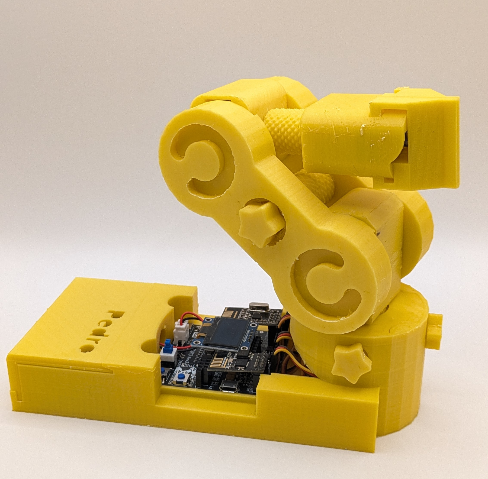
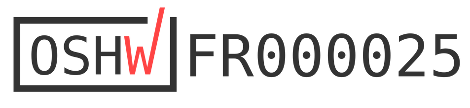

[![Contributors][contributors-shield]][contributors-url]
[![Forks][forks-shield]][forks-url]
[![Stargazers][stars-shield]][stars-url]
[![Apache-2.0 License][license-shield]][license-url]
[![LinkedIn][linkedin-shield]][linkedin-url]
[![Kickstarter][kickstarter-shield]][kickstarter-url]
[![discord][discord-shield]][discord-url]

[kickstarter-shield]: https://img.shields.io/badge/kickstarter-00C300?style=for-the-badge&logo=kickstarter&logoColor=white
[kickstarter-url]: https://www.kickstarter.com/projects/731479134/pedro-0

[discord-shield]: https://img.shields.io/badge/Discord-%235865F2.svg?style=for-the-badge&logo=linkedin&colorB=red
[discord-url]: https://discord.com/invite/TxkWNPU3ES

[linkedin-shield]: https://img.shields.io/badge/-LinkedIn-black.svg?style=for-the-badge&logo=linkedin&colorB=blue
[linkedin-url]: https://linkedin.com/in/almoutazar-saandi

[contributors-shield]: https://img.shields.io/github/contributors/almtzr/Pedro.svg?style=for-the-badge&colorB=red
[contributors-url]: https://github.com/almtzr/Pedro/graphs/contributors

[forks-shield]: https://img.shields.io/github/forks/almtzr/Pedro.svg?style=for-the-badge&colorB=yellow
[forks-url]: https://github.com/almtzr/Pedro/network/members

[stars-shield]: https://img.shields.io/github/stars/almtzr/Pedro.svg?style=for-the-badge&colorB=orange
[stars-url]: https://github.com/almtzr/Pedro/stargazers

[license-shield]: https://img.shields.io/github/license/almtzr/Pedro.svg?style=for-the-badge&colorB=286
[license-url]: https://github.com/almtzr/Pedro/blob/main/LICENSE

---

<p align="center">
  <a href="https://pedrobot.com" style="font-size:100px;">
    Get Ready to Buy Pedro Robot – Launching Soon!
  </a>
</p>
<br>
<br>

# Pedro — Open Source Educational Robot

Pedro is a fully open source, 3D-printable, portable educational robot designed for learning robotics, electronics, and programming.
Built with simplicity and expandability in mind, Pedro empowers students, makers, and educators to explore STEM hands-on.

- Pedro is OSHWA Certified and built with open-source hardware and software.
- Works out of the box and supports multiple control modes: USB, Bluetooth, WiFi, NRF24L01, and Serial.
- Fully Arduino-compatible, programmable in C++.

<br>

<div align="center">
    
</div>

<br>

## Associated Repositories

🔧 Each Pedro repository serves a specific role in the ecosystem:

### 📂 [`Pedro-Firmware`](https://github.com/almtzr/Pedro-Firmware)
> 🧠 **Pedro's brain**: Source code for the embedded firmware that runs on Pedro's controller.  
- Modular C++ code  
- Supports USB, Bluetooth, WiFi, Serial, and NRF24L01 control  
- Includes `.hex` builds for flashing  
- Arduino-compatible `.zip` library for developers  

---

### 📂 [`Pedro-IHM`](https://github.com/almtzr/Pedro-IHM)
> 💻 **Pedro IHM (Interface Homme-Machine)**: A desktop app for Windows, macOS, and Linux that allows users to:
- Control Pedro in real-time  
- Flash the firmware without needing to install AVRDUDE separately  
- Connect via USB or Bluetooth  
- Simple and cross-platform Python-based app (bundled with compiled `.exe`, `.dmg`, and Linux builds)

---

### 📂 [`Pedro-Get-Started`](https://github.com/almtzr/Pedro-Get-Started)
> 🤖 **Bring Pedro to life**: This repository contains everything you need to assemble your Pedro robot from scratch.
- 3D printing instructions and STL files
- Step-by-step assembly guide
- Complete list of required parts and electronics

<div align="left">
    
</div>

---

## Certified OSHW

In Feburary 2025, Pedro Robot has been certified as open-source hardware by the Open Source Hardware Association under UID: [FR000025](https://certification.oshwa.org/fr000025.html).

<a href="https://www.kickstarter.com/projects/731479134/pedro-0">
<div align="left">
    
</div>
</a>

## Kickstarter Funded

In March 2025, Pedro was successfully funded on [Kickstarter at 268%](https://www.kickstarter.com/projects/731479134/pedro-0) of its goal, receiving incredible support from backers around the world. 🙏 A huge thank you to all our backers for believing in the project!

<a href="https://www.kickstarter.com/projects/731479134/pedro-0">
<div align="left">
     
</div>
</a>

## 1. Features

Pedro is powered by an integrated ATmega32u4 microcontroller, making it easily programmable using the Arduino environment ideal for learning robotics and coding. All of its components are designed to be 3D printed, and the robot can be assembled without any tools, offering a hands-on and accessible experience for users of all levels.

</br>

- **4 Mini Servo Motors**: For precise movements.
- **Arduino-Compatible Board**: Designed specifically for this project, offering easy integration with the robot's components.
- **7.4V Batteries**: Powering the robot, rechargeable via USB.
- **Fully 3D Printable**: All structural components can be printed on a standard 3D printer.
- **Tool-Free Assembly**: Designed to snap together easily without the need for tools.
- **Micro USB Cable**: Enables charging, firmware uploads, and serial data exchange with the control application.

## 2. Pedro Boards

The Pedro Board is here to revolutionize how you learn and create in electronics, programming, and robotics. Designed with simplicity and versatility in mind, this open-source board comes in two versions: 
- **Rev2** with 2 integrated modules: **NRF24L01** and **OLED 128x64**.
- **Rev3** with 4 integrated modules: Rev2 modules + **ESP8266-01** and **HC-05**

Both versions offer a compact and efficient design to help you bring your Pedro Robot to life!

Additionally, the [**Gerber files for the Pedro Rev 2**](https://github.com/almtzr/Pedro/tree/main/gerber/rev2.1) are available for those who want to create their own custom Pedro robot board.

<div align="left">
    
</div>

<br>

- **OLED Screen (128x64)**: Visualize data, debug in real-time, or create interactive menus.
- **NRF24L01**: Enable long-range wireless communication between Pedro or devices.
- **ESP8266-01 WiFi Module**: Bring your Pedro online with ease. (**Rev3 only**)
- **HC-05 Bluetooth Module**: Connect wirelessly to smartphones or other devices. (**Rev3 only**)

## 3. How to Build Your Pedro

Pedro is a compact and customizable mini robotic arm entirely 3D printed, specifically designed for STEM projects. Equipped with four mini servo motors and powered by a custom-made Arduino-compatible board, Pedro offers versatile wireless communication options with its integrated **nRF24L01 module for remote control**, **HC-05 Bluetooth module for smartphone connectivity**, and **ESP8266 WiFi module for IoT integration**. It also features an **OLED 128x64 display**, allowing real-time feedback and data visualization. <br>

To ensure smooth and accurate operations, Pedro is equipped with **two ball bearings**, strategically placed for enhanced precision in its movements. This versatile and educational robot is perfect for hobbyists, students, and makers looking to explore robotics, electronics, and programming, all while enjoying a hands-on and engaging experience.

Checkout the [Pedro Get Started](https://github.com/almtzr/Pedro-Get-Started/tree/main) repo to bring your Pedro to life. You'll find detailed assembly instructions, Programming guides and much more.

## 4. Applications

### Radio communication by NRF24L01 module

<div align="left">
    
</div>

### Bluetooth communication by HC-O5 module

 <div align="left">
    
</div>

## 5. Contributing
We welcome contributions from the community! Here's how you can help:

1. **Fork the Repository**: Click the "Fork" button at the top right of this page.
2. **Clone Your Fork**: 
   ```
   git clone https://github.com/almtzr/Pedro.git
   ```
3. **Create a Branch**: 
   ```
   git checkout -b feature/your-feature-name
   ```
4. **Make Your Changes**: Add new features, fix bugs, or improve documentation.
5. **Commit and Push**: 
   ```
   git commit -m "Add your message here"
   git push origin feature/your-feature-name
   ```
6. **Submit a Pull Request**: Navigate to the original repository and submit a pull request.

### Explore the Incredible Possibilities

The programming possibilities are endless, providing an opportunity for both beginners and advanced users to push the boundaries of what Robot Pedro can achieve. Enjoy the process of learning, experimenting, and refining your programming skills with this remarkable STEAM education tool.

<div align="center">
    
</div>

## 7. License
This project is licensed under the Apache-2.0 License. See the `LICENSE` file for more details.


---

> Hi, I'm Almoutazar SAANDI, computer engineer based in France. In my free time, I enjoy creating open-source projects, and Pedro is one of them. 
If you need more details or have any questions about Pedro, feel free to reach out to me.

---
