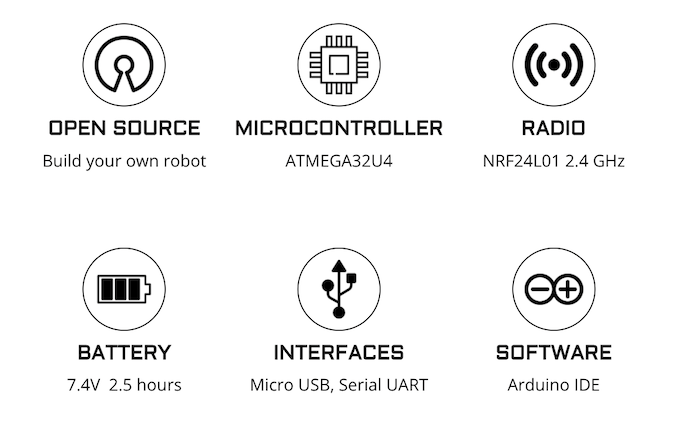

## New Pedro 2.0 (Project under development..)

    

## Board

Based on a microcontroller ATmega32u4 for C++ programming the Pedro board is powered by 7.4v (3.7v for remote board) 9800mAh rechargeable battery, providing a battery life up to 2.5 hours.
The micro USB port is designed for :

- charging the battery
- uploading code
- enabling serial communication

    

## Features

    

## Easy to build

The innovative design of the Pedro robot relies on the possibility of 3D printing all its components. What sets Pedro apart is its unique feature of being assembled without requiring any tools. This revolutionary characteristic significantly simplifies the assembly process, providing a practical and accessible approach for everyone while fully leveraging the benefits of additive manufacturing. The future of robotics is taking shape with Pedro, symbolizing the perfect blend of innovative technology and user-friendly simplicity.

    

## Learning STEAM with Pedro
 

    

## Discussion Forum

## Update history

- janurary 8th 2024 - Pedro github repository creation

