[![Contributors][contributors-shield]][contributors-url]
[![Forks][forks-shield]][forks-url]
[![Stargazers][stars-shield]][stars-url]
[![Apache-2.0 License][license-shield]][license-url]
[![LinkedIn][linkedin-shield]][linkedin-url]

[linkedin-shield]: https://img.shields.io/badge/-LinkedIn-black.svg?style=for-the-badge&logo=linkedin&colorB=blue
[linkedin-url]: https://linkedin.com/in/almoutazar-saandi

[contributors-shield]: https://img.shields.io/github/contributors/almtzr/Pedro.svg?style=for-the-badge&colorB=red
[contributors-url]: https://github.com/almtzr/Pedro/graphs/contributors

[forks-shield]: https://img.shields.io/github/forks/almtzr/Pedro.svg?style=for-the-badge&colorB=yellow
[forks-url]: https://github.com/almtzr/Pedro/network/members

[stars-shield]: https://img.shields.io/github/stars/almtzr/Pedro.svg?style=for-the-badge&colorB=orange
[stars-url]: https://github.com/almtzr/Pedro/stargazers

[license-shield]: https://img.shields.io/github/license/almtzr/Pedro.svg?style=for-the-badge&colorB=286
[license-url]: https://github.com/almtzr/Pedro/blob/main/LICENSE

<br>
<div align="center">
    <a href="https://www.kickstarter.com/projects/731479134/pedro-0" target="_blank">
        
    </a>
</div>

<br>

🚀 Pedro is Launching on Kickstarter on March 1st, 2025! 🎉

The wait is almost over! Pedro, the open-source robotic arm, will officially launch on Kickstarter on March 1st, 2025.

🔧 Fully Open Source <br>
📡 4 modules in one board: NRF24L01, ESP8266-01, Bluetooth HC-05, OLED Display <br>
🔋 Powered by a 7.4V 3500mAh battery <br>
🎮 Wireless Control & Arduino-Compatible <br>
💡 Be ready to back the project and bring Pedro to life! 

📅 Don’t miss the launch! <br>

<div align="center">
    
</div>

---

# Pedro 2.0

## Overview

Pedro is a sophisticated mini robotic arm designed to be entirely 3D printed and assembled without any tools. Equipped with four mini servo motors and powered by a custom-made Arduino-compatible board, Pedro offers versatile wireless communication options with its integrated **nRF24L01 module for remote control**, **HC-05 Bluetooth module for smartphone connectivity**, and **ESP8266 WiFi module for IoT integration**. It also features an **OLED 128x64 display**, allowing real-time feedback and data visualization.

To ensure smooth and accurate operations, Pedro is equipped with two ball bearings, strategically placed for enhanced precision in its movements. This versatile and educational robot is perfect for hobbyists, students, and makers looking to explore robotics, electronics, and programming, all while enjoying a hands-on and engaging experience.

<div align="center">
    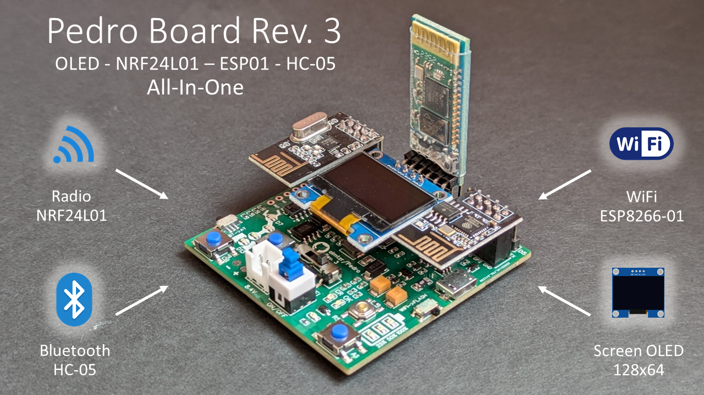
</div>

## 1. Features

Pedro is a compact, DIY robot that you can build and program yourself. All parts of Pedro are designed to be 3D printed, and the robot can be assembled without any additional tools.

<div align="left">
    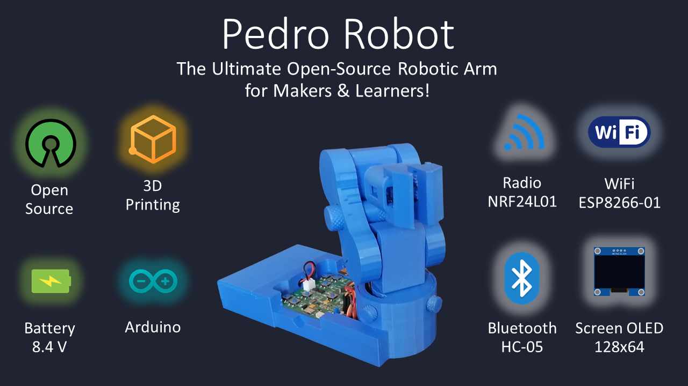
</div>

</br>

- **4 Mini Servo Motors**: For precise movements.
- **Arduino-Compatible Board**: Designed specifically for this project, offering easy integration with the robot's components.
- **Two Rechargeable 18650 Batteries**: Powering the robot, rechargeable via USB.
- **Fully 3D Printable**: All structural components can be printed on a standard 3D printer.
- **Tool-Free Assembly**: Designed to snap together easily without the need for tools.
- **Micro USB Cable**: For Charging and Programming.

## 2. Boards

The Pedro Board is here to revolutionize how you learn and create in electronics, programming, and robotics. Designed with simplicity and versatility in mind, this open-source board comes in two versions: the **Pedro Rev 3** (left) with 4 powerful integrated modules (**NRF24L01**, **ESP8266-01**, **HC-05**, and **OLED 128x64**) and the **Pedro Rev 2** (right) with 2 integrated modules (**NRF24L01** and **OLED 128x64**). Both versions offer a compact and efficient design to help you bring your robotic projects to life!

Additionally, the **Gerber files for the Pedro Rev 2** are available for those who want to create their own custom Pedro robot board.

<div align="left">
    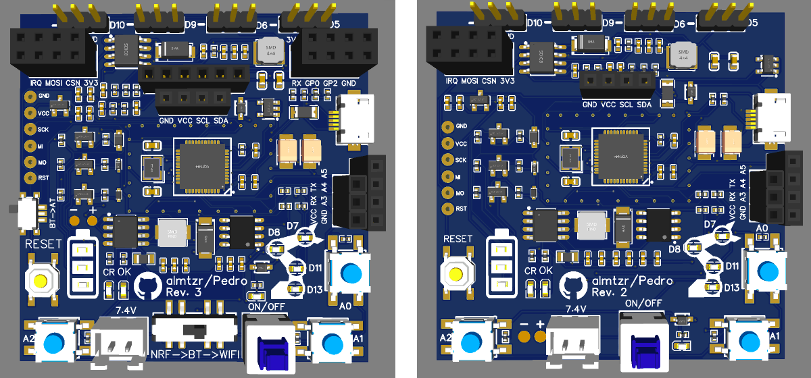
</div>

<br>

- **OLED Screen (128x64)**: Visualize data, debug in real-time, or create interactive menus.
- **NRF24L01**: Enable long-range wireless communication between Pedro or devices.
- **ESP8266-01 WiFi Module**: Bring your Pedro online with ease. (**Rev 3 only**)
- **HC-05 Bluetooth Module**: Connect wirelessly to smartphones or other devices. (**Rev 3 only**)

| Pedro Board         | Arduino Pin | Function                  |
|---------------------|-------------|---------------------------|
| Servo 1             | D5          | PWM Signal                |
| Servo 2             | D6          | PWM Signal                |
| Servo 3             | D9          | PWM Signal                |
| Servo 4             | D10         | PWM Signal                |
| Button 1  (Up)      | A0          | Select Servo              |
| Button 2 (Right)    | A1          | Servo Rotation (forward)  |
| Button 3 (Left)     | A2          | Servo Rotation (backward) |
| LED Servo 1         | D13         | Servo 1 Indicator         |
| LED Servo 2         | D11         | Servo 2 Indicator         |
| LED Servo 3         | D8          | Servo 3 Indicator         |
| LED Servo 4         | D7          | Servo 4 Indicator         |
| NRF24L01 CE         | D4          | SPI Enable (Radio)        |
| NRF24L01 CSN        | D12         | SPI Chip Select (Radio)   |
| OLED Display (SDA)  | D2          | I2C Data                  |
| OLED Display (SCL)  | D3          | I2C Clock                 |
| HC-05 TX	          | D0          | UART RX (Bluetooth)       |
| HC-05 RX            | D1          | UART TX (Bluetooth)       |
| ESP8266 TX	      | D0          | UART RX (WiFi)            |
| ESP8266 RX          | D1          | UART TX (WiFi)            |
| Switch 1 (Middle)   | N/A         | Select Mode Radio, Bluetooth, WiFi |
| Switch 2 (Right)    | N/A         | Select Mode Flash (ESP8266-01) |
| Switch 3 (Left)     | N/A         | Select Mode AT (HC-05)   |

### 2.1 Radio communication by NRF24L01 module

<div align="left">
    
</div>


### 2.2 Bluetooth communication by HC-O5 module
 ... work in progress ...
 
### 2.3 WiFi communication by ESP8266-01 module
 ... work in progress ...


## 3. Programming Pedro

<div align="left">
    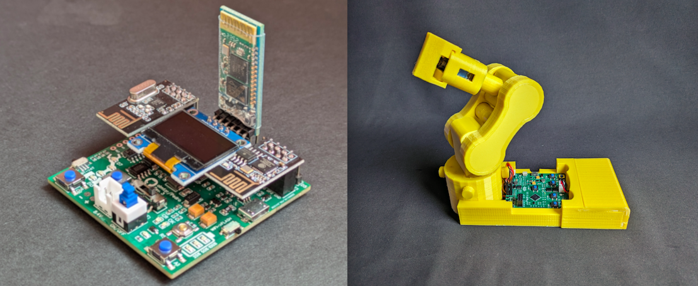
</div>

<br>

1. Install the Arduino IDE if not already installed, download and install the [Arduino IDE](https://www.arduino.cc/en/software).
2. Download the code clone this repository or download the zip file and extract it.
3. Upload the code file in the Arduino IDE and upload it to the Pedro board.

- [For basic control](https://github.com/almtzr/Pedro/blob/main/code/basic)
- [For remote control](https://github.com/almtzr/Pedro/blob/main/code/remote)
- [For dual remote control](https://github.com/almtzr/Pedro/blob/main/code/dual)

## 4. 3D Printing Files

To create the Pedro robot, download the [.stl files](https://github.com/almtzr/Pedro/tree/main/stl/v2.0), prepare your 3D printer, and follow the assembly instructions provided in the images.

**Please note that some parts, like the gripper, are still a work in progress.**

<div align="center">
    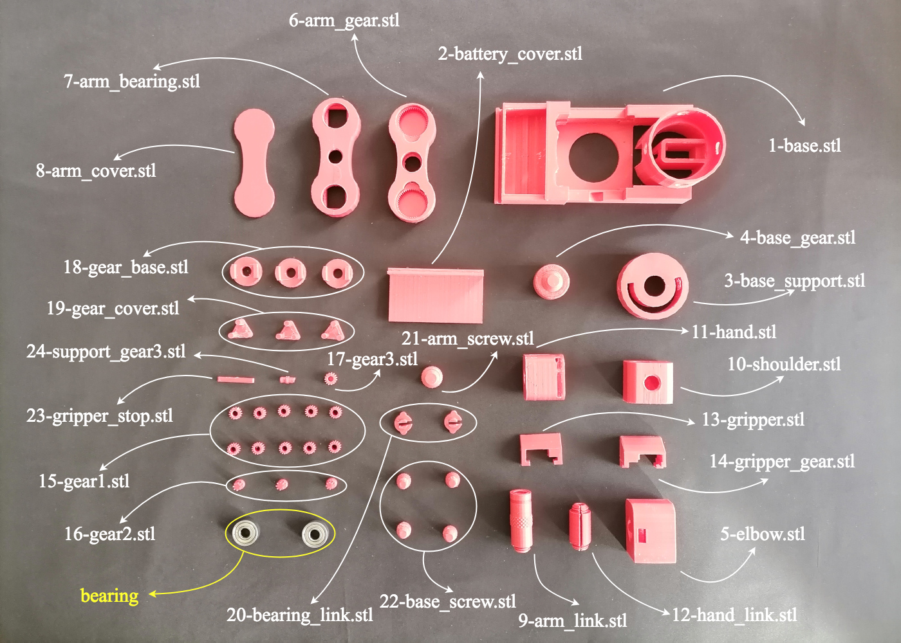
</div>

## 5. Do It Yourself

<div align="left">
    
</div>

Everything you need to bring the Pedro robot to life:


<div align="left">
    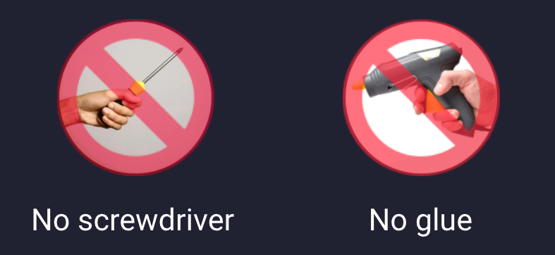
</div>

- 4 Servomotors 360° SG90
- Pedro board
- Micro USB cable
- 2 18650 Batteries 3.7V
- 2 Ball bearings
  
<div align="left">
    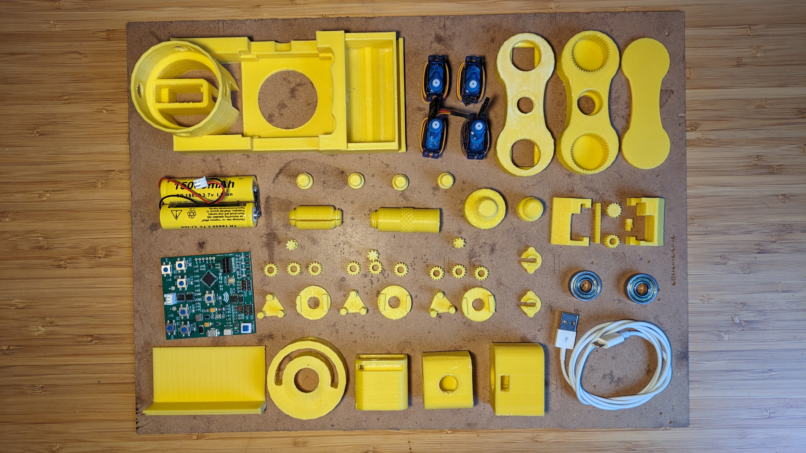
</div>


### STEP 1:

|  |  | 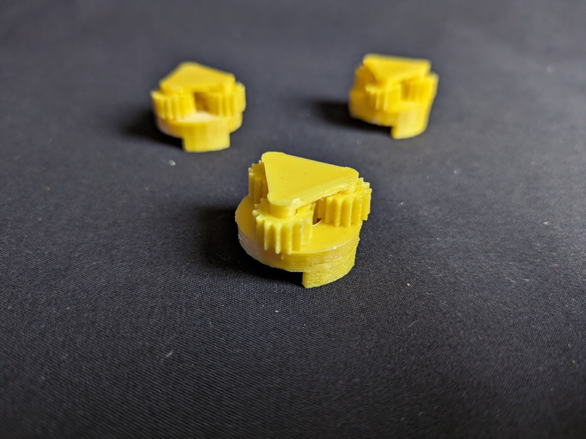 |
|---------------------------------------|---------------------------------------|---------------------------------------|

### STEP 2:

|  |  |  |
|---------------------------------------|---------------------------------------|---------------------------------------|

### STEP 3:

|  |  |  |
|---------------------------------------|---------------------------------------|---------------------------------------|

### STEP 4:

|  |  |  |
|---------------------------------------|---------------------------------------|---------------------------------------|

### STEP 5:

|  |  |  |
|---------------------------------------|---------------------------------------|---------------------------------------|

### STEP 6:

|  |  |  |
|---------------------------------------|---------------------------------------|---------------------------------------|

### STEP 7:

|  | 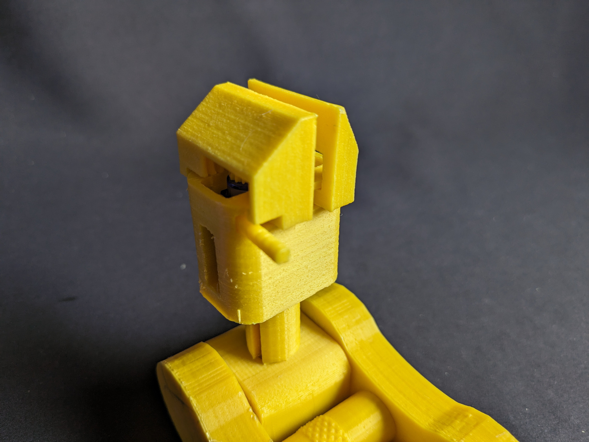 | 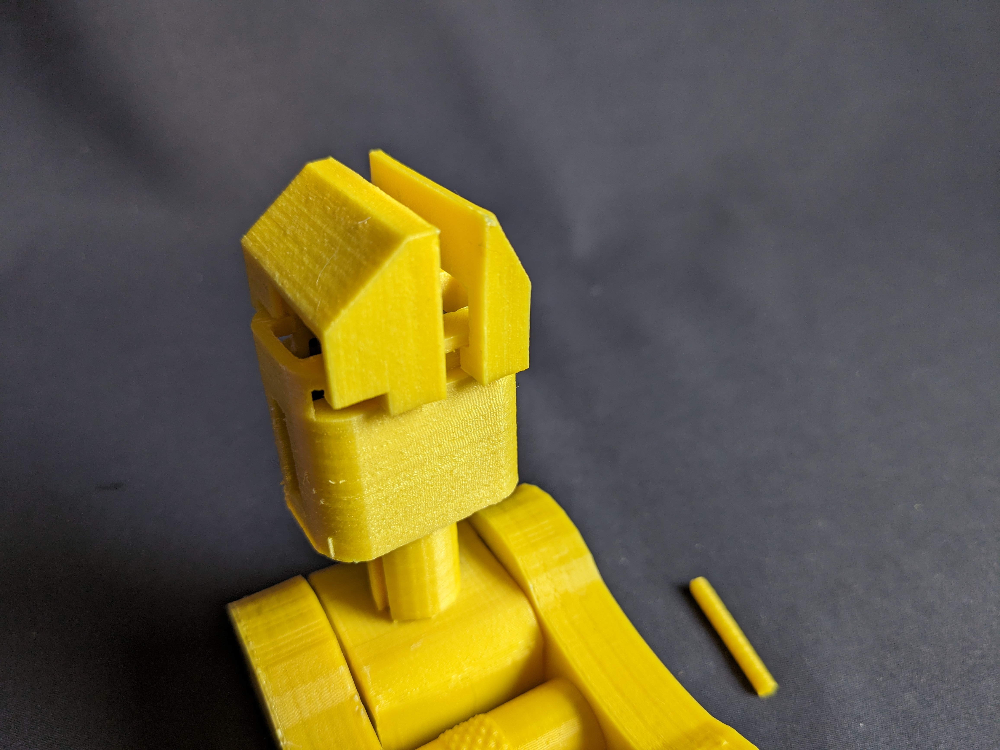 |
|---------------------------------------|---------------------------------------|---------------------------------------|

### STEP 8:

| 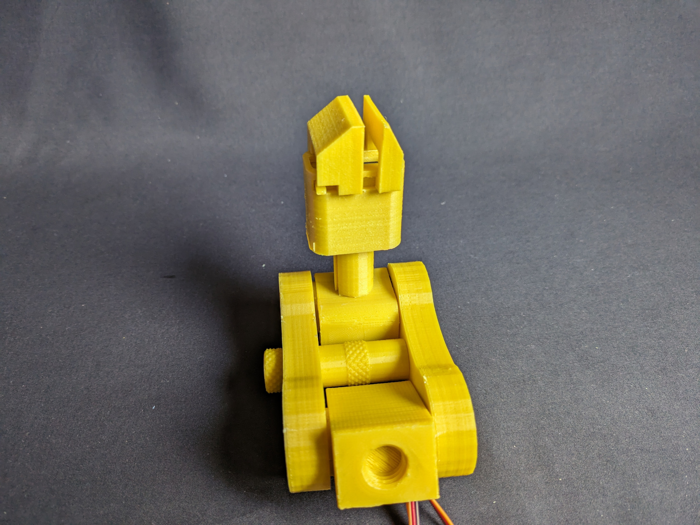 | 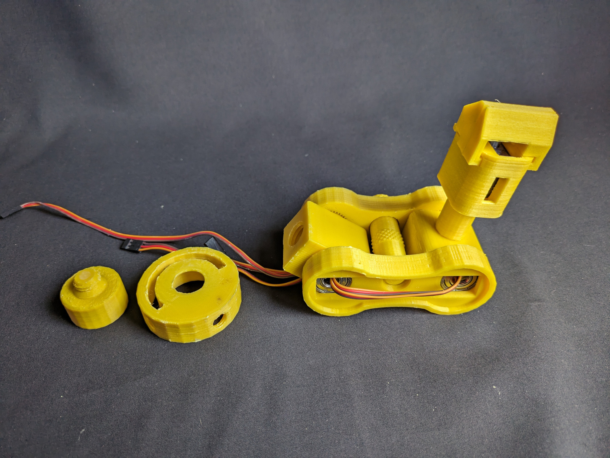 |  |
|---------------------------------------|---------------------------------------|---------------------------------------|

### STEP 9:

|  |  |  |
|---------------------------------------|---------------------------------------|---------------------------------------|

<div align="left">
    
</div>

## 5. Contributing
We welcome contributions from the community! Here's how you can help:

1. **Fork the Repository**: Click the "Fork" button at the top right of this page.
2. **Clone Your Fork**: 
   ```
   git clone https://github.com/almtzr/Pedro.git
   ```
3. **Create a Branch**: 
   ```
   git checkout -b feature/your-feature-name
   ```
4. **Make Your Changes**: Add new features, fix bugs, or improve documentation.
5. **Commit and Push**: 
   ```
   git commit -m "Add your message here"
   git push origin feature/your-feature-name
   ```
6. **Submit a Pull Request**: Navigate to the original repository and submit a pull request.

### Explore the Incredible Possibilities

The programming possibilities are endless, providing an opportunity for both beginners and advanced users to push the boundaries of what Robot Pedro can achieve. Enjoy the process of learning, experimenting, and refining your programming skills with this remarkable STEAM education tool.

<div align="center">
    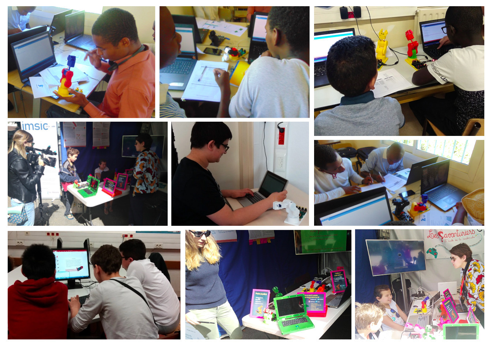
</div>

## 6. License
This project is licensed under the Apache-2.0 License. See the `LICENSE` file for more details.

---

> Hi, I'm Almoutazar SAANDI, computer engineer based in France. In my free time, I enjoy creating open-source projects, and Pedro is one of them. 
If you need more details or have any questions about Pedro, feel free to reach out to me.

---
