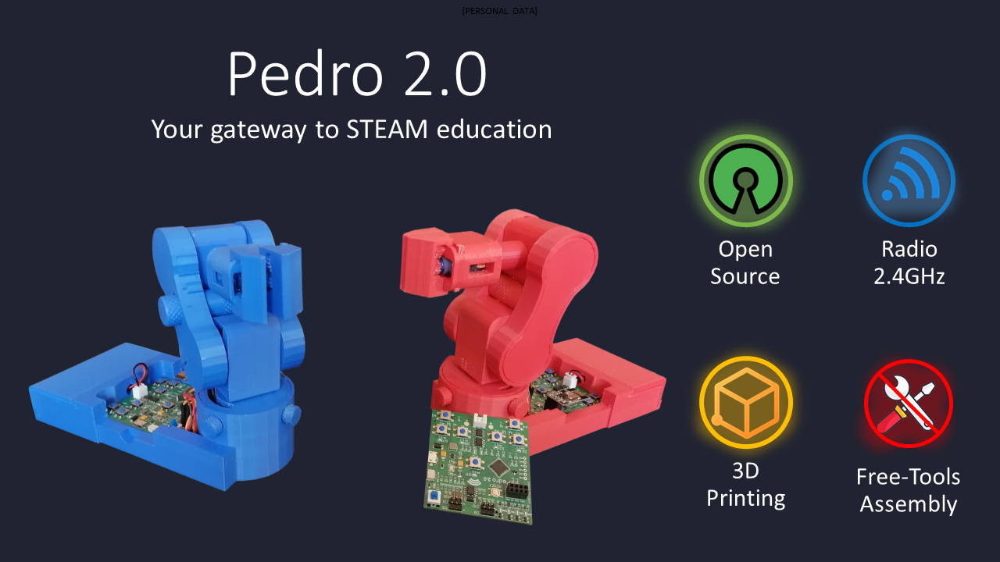

[![Contributors][contributors-shield]][contributors-url]
[![Forks][forks-shield]][forks-url]
[![Stargazers][stars-shield]][stars-url]
[![Apache-2.0 License][license-shield]][license-url]
[![LinkedIn][linkedin-shield]][linkedin-url]

[linkedin-shield]: https://img.shields.io/badge/-LinkedIn-black.svg?style=for-the-badge&logo=linkedin&colorB=blue
[linkedin-url]: https://linkedin.com/in/almoutazar-saandi

[contributors-shield]: https://img.shields.io/github/contributors/almtzr/Pedro.svg?style=for-the-badge&colorB=red
[contributors-url]: https://github.com/almtzr/Pedro/graphs/contributors

[forks-shield]: https://img.shields.io/github/forks/almtzr/Pedro.svg?style=for-the-badge&colorB=yellow
[forks-url]: https://github.com/almtzr/Pedro/network/members

[stars-shield]: https://img.shields.io/github/stars/almtzr/Pedro.svg?style=for-the-badge&colorB=orange
[stars-url]: https://github.com/almtzr/Pedro/stargazers

[license-shield]: https://img.shields.io/github/license/almtzr/Pedro.svg?style=for-the-badge&colorB=286
[license-url]: https://github.com/almtzr/Pedro/blob/main/LICENSE

<div align="center">
    <a href="https://www.kickstarter.com/projects/731479134/pedro-0" target="_blank">
        
    </a>
</div>

<br>

# Pedro 2.0

> Hi, I'm Almoutazar SAANDI, a computer engineer based in France. In my free time, I enjoy creating open-source projects, and Pedro is one of them. 
If you need more details or have any questions about Pedro, feel free to reach out to me.

## Overview

Pedro is a sophisticated mini robotic arm designed to be entirely 3D printed and assembled without any tools. Equipped with four mini servo motors and powered by a custom-made Arduino-compatible board, Pedro can be controlled remotely using an nRF24L01 module. It features three ball bearings for enhanced precision in its movements. These bearings are strategically placed to ensure smooth and accurate operations. This versatile and educational robot is perfect for hobbyists, students, and makers looking to explore robotics, electronics, and programming.

<div align="center">
    
</div>

## 1. Project Description

Pedro is a compact, DIY robot that you can build and program yourself. All parts of Pedro are designed to be 3D printed, and the robot can be assembled without any additional tools. The Pedro board, along with the nRF24L01 module, allows for wireless control, making Pedro a flexible and interactive project.

### Features

- **4 Mini Servo Motors**: For precise movements.
- **Arduino-Compatible Board**: Designed specifically for this project, offering easy integration with the robot's components.
- **nRF24L01 Module**: For wireless communication.
- **Two Rechargeable 18650 Batteries**: Powering the robot, rechargeable via USB.
- **Fully 3D Printable**: All structural components can be printed on a standard 3D printer.
- **Tool-Free Assembly**: Designed to snap together easily without the need for tools.
- **Micro USB Cable**: For Charging and Programming.
  
<div align="left">
    
</div>

## 2. Electronics Board

The electronics board for the Pedro robot, powered by an **ATmega32u4 microcontroller** compatible with Arduino, makes programming and customization easy. Running on an **8.4V DC battery**, it provides reliable autonomy, while the **NRF24L01 wireless module** enables remote communication. 

Equipped with **7 programmable buttons** and **5 programmable LEDs**, it allows real-time control and interaction. The **USB port** simplifies programming, making Pedro adaptable for a variety of robotic projects.

<div align="left">
    
</div>

## 3. Programming Pedro

1. Install the Arduino IDE if not already installed, download and install the [Arduino IDE](https://www.arduino.cc/en/software).
2. Download the code clone this repository or download the zip file and extract it.
3. Upload the code file in the Arduino IDE and upload it to the Pedro board.

- [For basic control](https://github.com/almtzr/Pedro/blob/main/code/basic)
- [For remote control](https://github.com/almtzr/Pedro/blob/main/code/remote)
- [For dual remote control](https://github.com/almtzr/Pedro/blob/main/code/dual)

## 4. Do it yourself

To create the Pedro robot, download the [.stl files](https://github.com/almtzr/Pedro/tree/main/stl/v2.0), prepare your 3D printer, and follow the assembly instructions provided in the images.

<div align="left">
    
</div>

## 5. Contributing
We welcome contributions from the community! Here's how you can help:

1. **Fork the Repository**: Click the "Fork" button at the top right of this page.
2. **Clone Your Fork**: 
   ```
   git clone https://github.com/almtzr/Pedro.git
   ```
3. **Create a Branch**: 
   ```
   git checkout -b feature/your-feature-name
   ```
4. **Make Your Changes**: Add new features, fix bugs, or improve documentation.
5. **Commit and Push**: 
   ```
   git commit -m "Add your message here"
   git push origin feature/your-feature-name
   ```
6. **Submit a Pull Request**: Navigate to the original repository and submit a pull request.

### Explore the Incredible Possibilities

The programming possibilities are endless, providing an opportunity for both beginners and advanced users to push the boundaries of what Robot Pedro can achieve. Enjoy the process of learning, experimenting, and refining your programming skills with this remarkable STEAM education tool.

<div align="center">
    
</div>

## 6. License
This project is licensed under the Apache-2.0 License. See the `LICENSE` file for more details.

---

Thank you for your interest in Pedro! We can't wait to see what you create with it. Happy building and coding!
