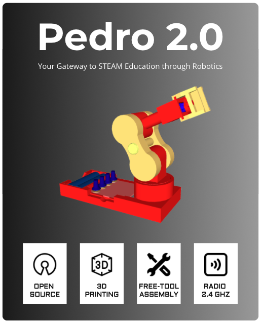
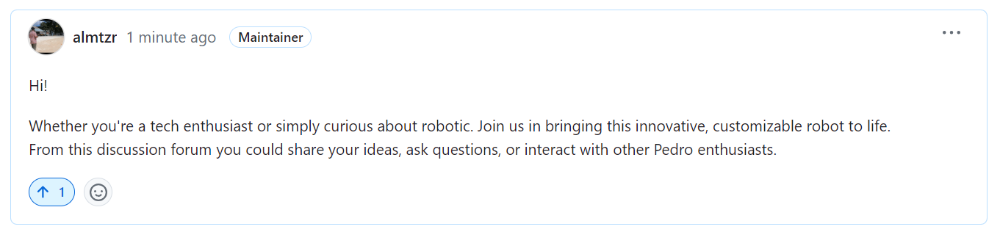

[![LinkedIn][linkedin-shield]][linkedin-url]

[linkedin-shield]: https://img.shields.io/badge/-LinkedIn-black.svg?style=for-the-badge&logo=linkedin&colorB=555
[linkedin-url]: https://linkedin.com/in/almoutazar-saandi
[product-screenshot]: images/screenshot.png

    
<b>Project under development..</b>

    

 
Robot Pedro 2.0 is an exciting open-source robotic arm designed specifically for fostering learning in the fields of Science, Technology, Engineering, Arts, and Mathematics (STEAM). With its user-friendly design and availability of STL files on Thingiverse (available soon..), Robot Pedro opens up a world of educational possibilities, making robotics accessible to enthusiasts, students, and educators alike.

## Key Features:

**Open Source Design:** Robot Pedro is built on the principles of open-source innovation. All the STL files for its parts are readily available on Thingiverse, encouraging collaboration, modification, and improvement within the community. This open approach empowers users to customize and enhance Pedro according to their unique educational needs.

**Educational Focus:** Pedro is not just a robotic arm; it's a powerful tool for STEAM education. Whether you're a student curious about robotics or an educator looking for an engaging teaching tool, Pedro provides hands-on learning experiences in a variety of disciplines. From programming and electronics to mechanics and design, Pedro covers it all.

**Accessible Materials:** The STL files for Robot Pedro's parts are easily accessible on Thingiverse, ensuring that anyone with a 3D printer can bring this robotic arm to life. This accessibility fosters a culture of learning and experimentation, enabling users to assemble, modify, and enhance their robotic arm with ease. Four servomotors SG90 are needed to assemble Pedro.

**Versatility in Applications:** Robot Pedro is versatile, allowing users to explore a range of applications. Whether it's learning about automation, honing programming skills, or diving into the intricacies of mechanical engineering, Pedro's adaptability makes it an ideal platform for hands-on STEAM projects.

**Community Collaboration:** Join the Robot Pedro community on platforms like Thingiverse and other online forums to share your experiences, ideas, and modifications. Collaborate with fellow enthusiasts and educators to contribute to the continuous improvement and evolution of Pedro.

## Board

Based on a microcontroller ATmega32u4 for C++ programming the Pedro board is powered by 7.4v (3.7v for remote board) 9800mAh rechargeable battery, providing a battery life up to 2.5 hours.
The micro USB port is designed for :

- charging the battery
- uploading code
- enabling serial communication

    

## How to Get Started:

**Building Robot Pedro: A Step-by-Step Guide**

Welcome to the exciting journey of building Robot Pedro, your open-source robotic arm designed for STEAM education. This guide will walk you through the assembly and calibration process, ensuring seamless integration with the Arduino IDE for programming.

**Step 1: Gather Your Materials**

Ensure you have all the necessary materials:

- 3D printed parts (downloaded from Thingiverse)
- 4 SG90 servo motors
- Electronic board (for Pedro)
- Remote board
- Arduino IDE installed on your computer
- USB cable for programming
- 8.4V battery (for Pedro board)
- 4.2V battery (for remote board)

No external tools are needed for the next steps

**Step 2: Program Pedro's Boards**

- Connect and Program Pedro's Electronic Board:
Use the USB cable to connect Pedro to the Arduino IDE. Ensure the correct port and board settings are selected. Upload the "pedroBoard.ino" sketch to program the electronic board. Disconnect Pedro once the upload is successful.

- Connect and Program Pedro's Remote Board:
Use the USB cable to connect the remote board to the Arduino IDE. Ensure the correct port and board settings are selected. Upload the "remoteBoard.ino" sketch to program the remote board. Disconnect the remote board once the upload is successful. Both boards are now ready for the next steps in building Robot Pedro.

**Step 3: Calibrate Servo Motors**

Before you begin assembly, ensure Pedro is powered off. Connect each of the four SG90 servo motors to the designated PWM pins (D5, D6, D9, D10) on the Pedro board. Ensure that the 8.4V battery is connected to the Pedro board for power.

To activate the calibration mode, press buttons D2 and D3 simultaneously and power on Pedro.

The LED D11 will start blinking slowly for the next 10 seconds, during which each servo motor will smoothly rotate to its predefined initial position.

Observe the gradual movement of each servo motor as they align to their starting positions. This calibration process ensures synchronization, preparing the robotic arm for precise movements during programming and operation.

Upon completion of the 10-second calibration period, signaled by the LED D11 turning off, the servo motors are ready for assembling each part of Pedro. This ensures a well-coordinated and accurately calibrated foundation for the subsequent steps in building your robotic companion.

**Step 4: Assemble the Physical Structure**

With the calibration complete, proceed to assemble the physical structure of Robot Pedro. Ensure each part fits securely, leveraging the calibrated servo motors for a stable and well-aligned robotic arm.

    

**Step 5: Verify Control Modes After Assembly**

Once Pedro is fully assembled, power it on. By default, the manual mode is enabled, indicated by the LED D8 being On.

- **Manual Mode (LED D8 On):**
In this mode, control Pedro using the potentiometers on the Pedro board. Observe how the arm responds to adjustments made with the potentiometers, allowing for direct, hands-on control.

- **Remote Mode (LED D7 On):**
Click on button D2 to activate the remote mode. In this mode, use the remote board to control Pedro wirelessly. Observe the LED D7 to confirm that remote mode is active. Explore how the remote control interface interacts with Pedro's movements, providing a versatile and engaging remote-control experience.

Ensure both modes operate smoothly, confirming that Pedro responds appropriately to manual and remote control inputs. This step ensures that your fully assembled robotic arm is ready to showcase its flexibility and functionality in different control scenarios.

Congratulations! You've successfully built Robot Pedro, the companion in your STEAM education journey. Enjoy exploring, experimenting, and learning with Robot Pedro!

**Explore the Incredible Possibilities**

Now that the basics are in place, dive deeper into programming Robot Pedro. Utilize the Arduino IDE to unlock the incredible potential of this robotic arm. Create custom movements, experiment with sequential actions, and explore the vast range of possibilities offered by the electronic board.

Unleash your creativity by developing unique programs that showcase Pedro's versatility and precision. Experiment with different motion sequences, speeds, and combinations to fully harness the capabilities of this incredible robotic arm.

The programming possibilities are endless, providing an opportunity for both beginners and advanced users to push the boundaries of what Robot Pedro can achieve. Enjoy the process of learning, experimenting, and refining your programming skills with this remarkable STEAM education tool.

**Join the Community**

Connect with the Robot Pedro community. Share your experiences, ask questions, and contribute your insights to the collaborative spirit of learning and improvement.

## Learning STEAM with Pedro
 

    

