[![Contributors][contributors-shield]][contributors-url]
[![Forks][forks-shield]][forks-url]
[![Stargazers][stars-shield]][stars-url]
[![LinkedIn][linkedin-shield]][linkedin-url]
[![thingiverse][thingiverse-shield]][thingiverse-url]
[![discord][discord-shield]][discord-url]
[![twitter][twitter-shield]][twitter-url]

[twitter-shield]: https://img.shields.io/badge/@LeRobotPedro-%235865F2.svg?style=for-the-badge&colorB=blue
[twitter-url]: https://x.com/LeRobotPedro

[thingiverse-shield]: https://img.shields.io/badge/thingiverse-%235865F2.svg?style=for-the-badge&logo=linkedin&colorB=blue
[thingiverse-url]: https://www.thingiverse.com/almtzr/designs

[discord-shield]: https://img.shields.io/badge/Discord-%235865F2.svg?style=for-the-badge&logo=linkedin&colorB=blue
[discord-url]: https://discord.com/invite/TxkWNPU3ES

[linkedin-shield]: https://img.shields.io/badge/-LinkedIn-black.svg?style=for-the-badge&logo=linkedin&colorB=blue
[linkedin-url]: https://linkedin.com/in/almoutazar-saandi

[contributors-shield]: https://img.shields.io/github/contributors/almtzr/Pedro.svg?style=for-the-badge&colorB=red
[contributors-url]: https://github.com/almtzr/Pedro/graphs/contributors

[forks-shield]: https://img.shields.io/github/forks/almtzr/Pedro.svg?style=for-the-badge&colorB=yellow
[forks-url]: https://github.com/almtzr/Pedro/network/members

[stars-shield]: https://img.shields.io/github/stars/almtzr/Pedro.svg?style=for-the-badge&colorB=orange
[stars-url]: https://github.com/almtzr/Pedro/stargazers

<br>

# 📂 Pedro

## 1. Features

</br>

- **Fully 3D Printable**: All structural components can be printed on a standard 3D printer.
- **4x Mini Servo Motors 360°**: For precise movements.
- **2x Bearing Balls 8x22x7 mm**: For smooth rotation.
- **Pedro Board**: Designed specifically for this project, offering easy integration with the robot's components.
- **7.4V Batteries**: Powering the robot, rechargeable via USB.
- **Micro USB Cable**: Enables charging, firmware uploads, and serial data exchange with the control application.
- **Tool-Free Assembly**: Designed to snap together easily without the need for tools.

<br>

<div align="left">
     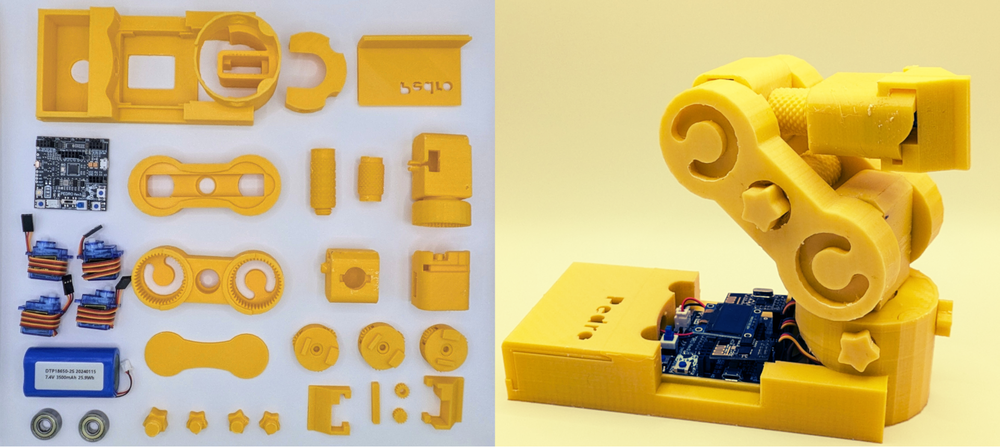
</div>

</br>

## 2. How to Print

✅ Material: PLA or ABS </br>
✅ Layer height: 0.2 mm

</br>

<div align="left">
     
     
</div>

<div align="left">
     
     
</div>

</br>

## 3. How to Assemble
</br>

| 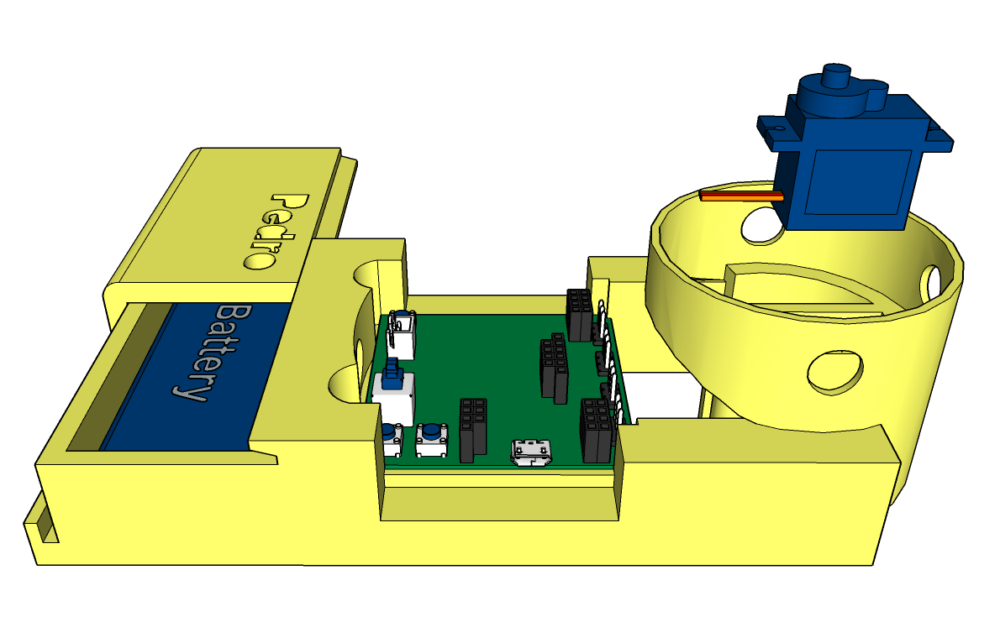    | 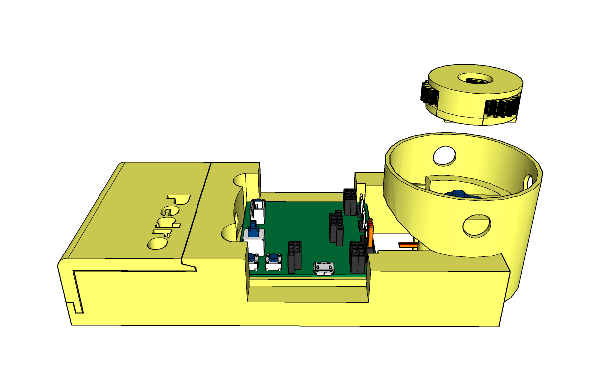    | 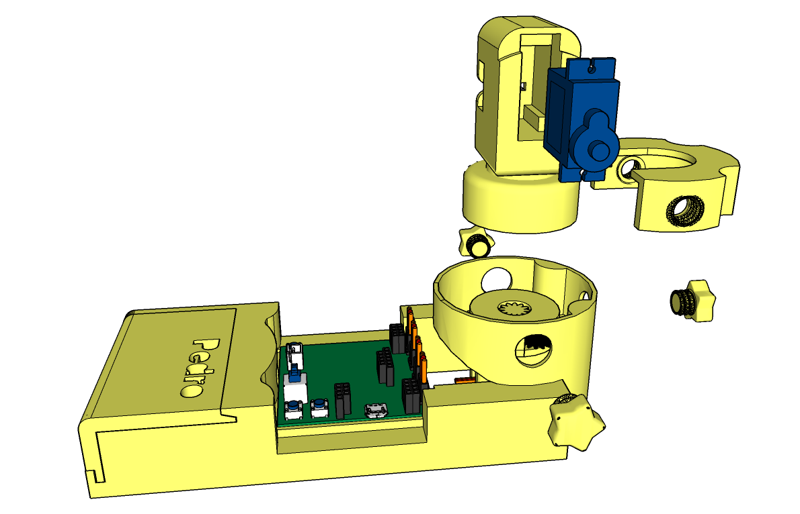    |  
|-----------------|-----------------|-----------------|
| 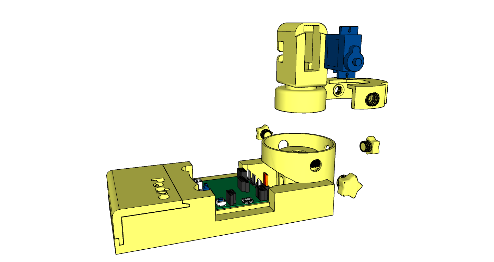    |     | 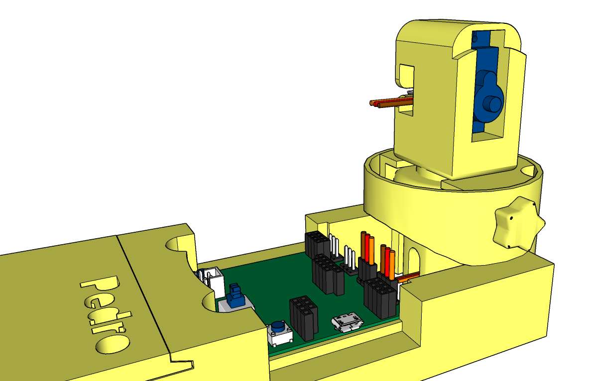    |
|     | 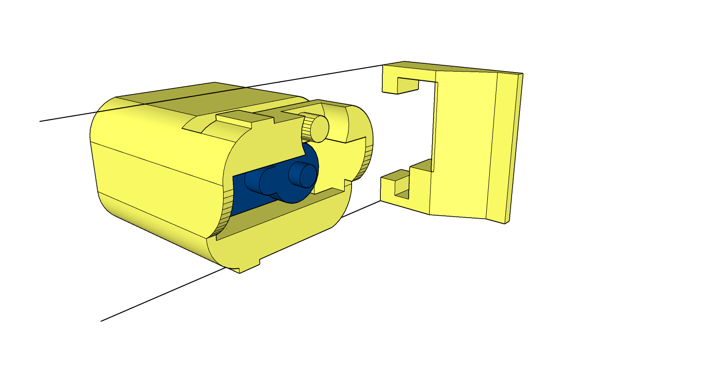    | 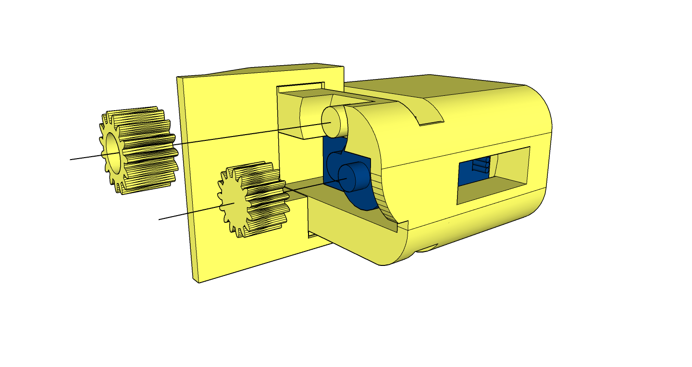    |  
| 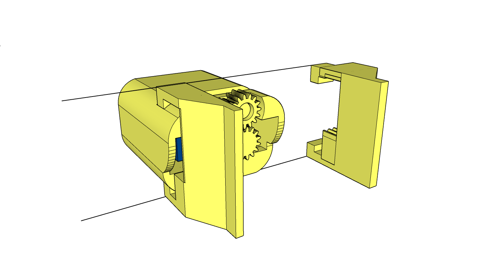    | 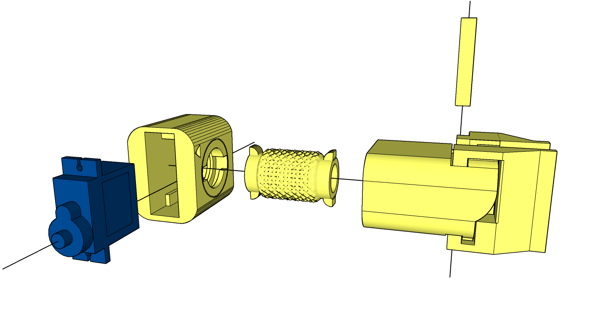    | 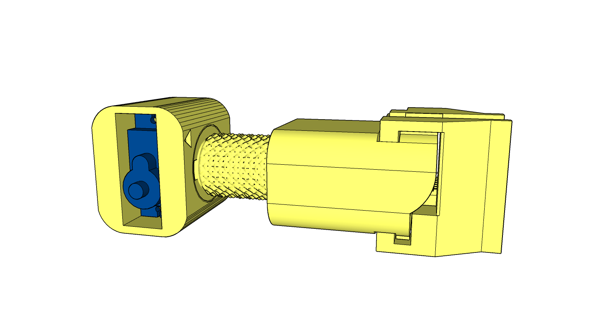    |
|     |     |     |
| 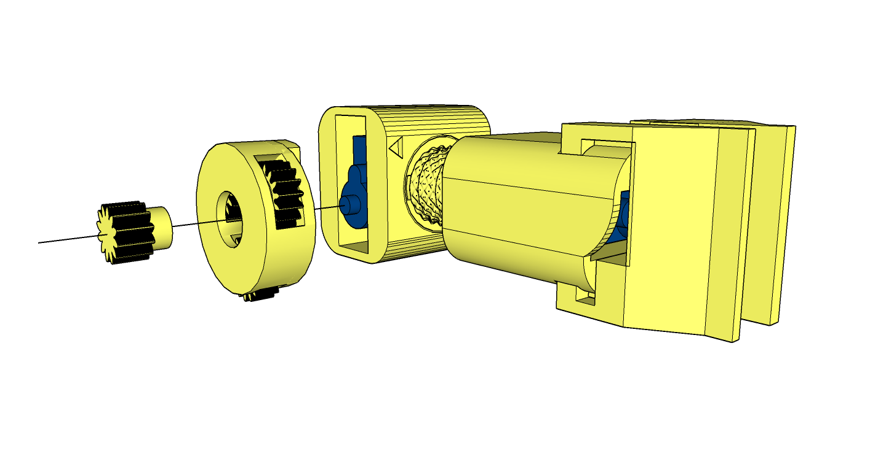    | 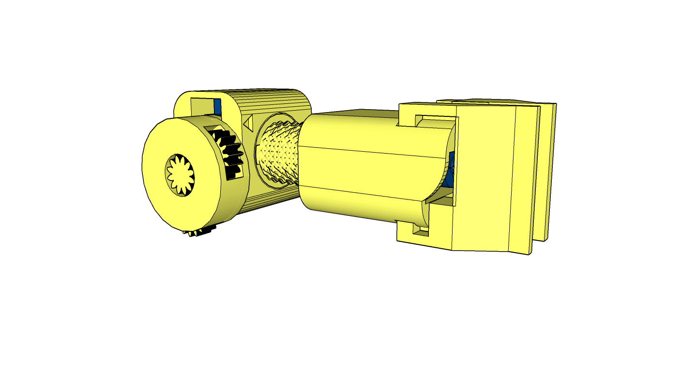    |     |
|     | 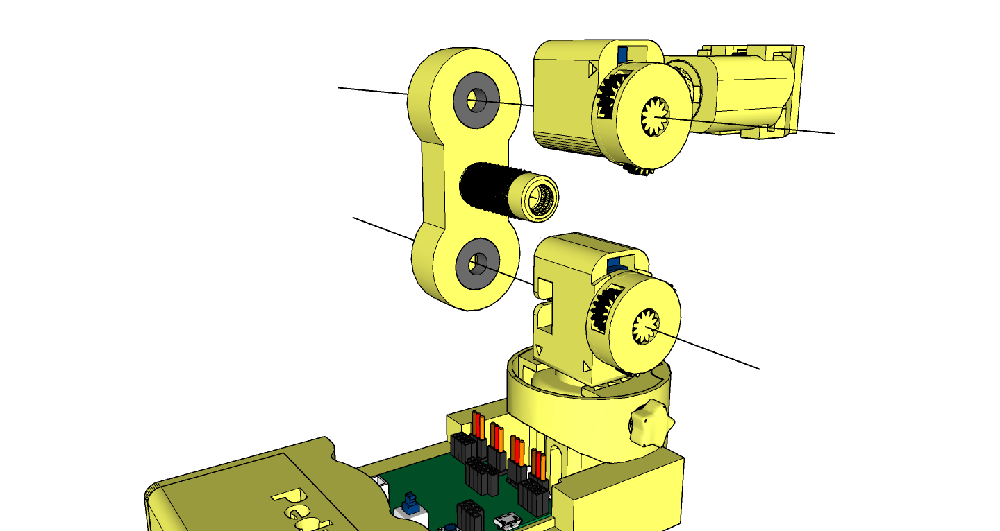    | 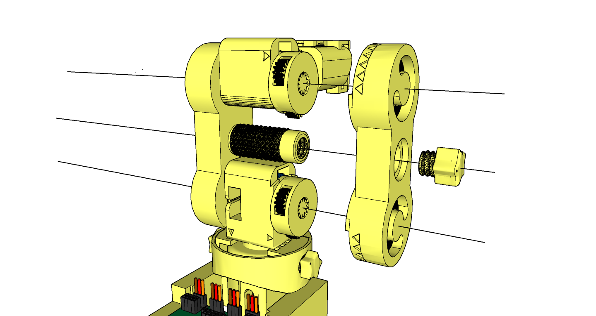    |


</br>

## 4. Some Use Cases

| Radio Mode | Bluetooth Mode | Repeat Mode |  
|-----------------|-----------------|-----------------|
|     |     |     |

</br>
  
## Contributing
We welcome contributions from the community! Here's how you can help:

1. **Fork the Repository**: Click the "Fork" button at the top right of this page.
2. **Clone Your Fork**: 
   ```
   git clone https://github.com/almtzr/Pedro.git
   ```
3. **Create a Branch**: 
   ```
   git checkout -b feature/your-feature-name
   ```
4. **Make Your Changes**: Add new features, fix bugs, or improve documentation.
5. **Commit and Push**: 
   ```
   git commit -m "Add your message here"
   git push origin feature/your-feature-name
   ```
6. **Submit a Pull Request**: Navigate to the original repository and submit a pull request.


